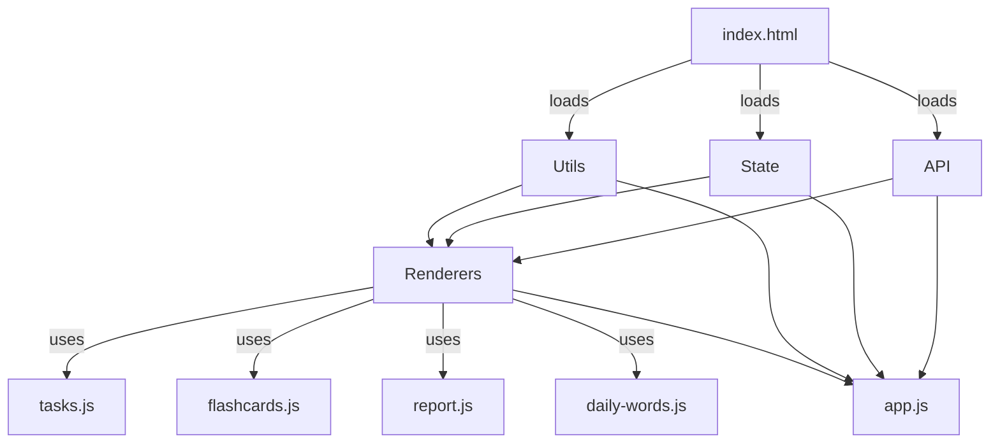
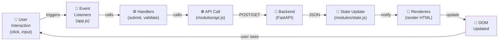
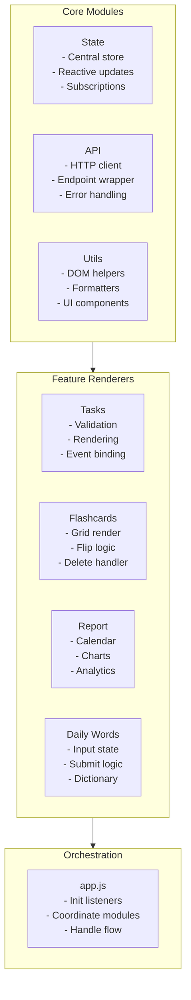
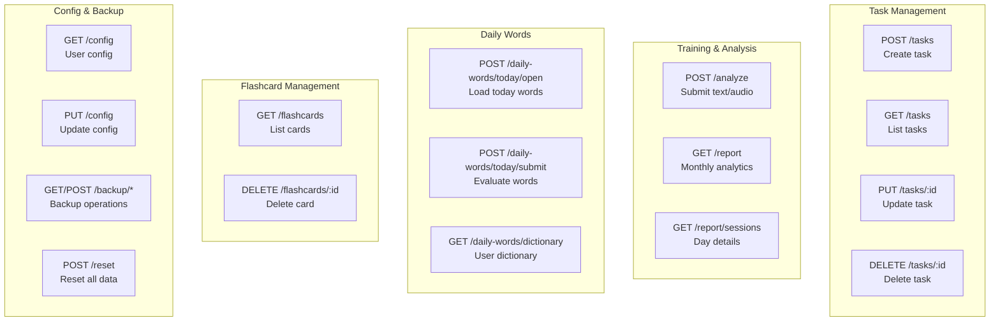
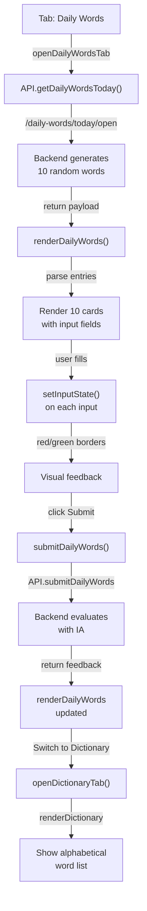
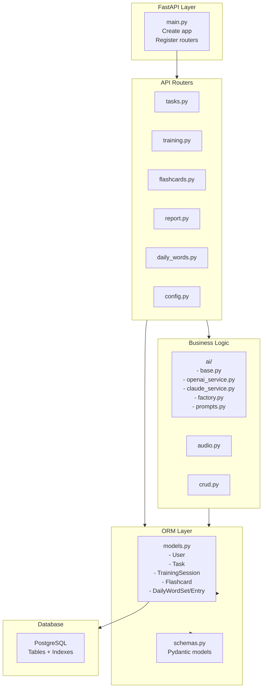
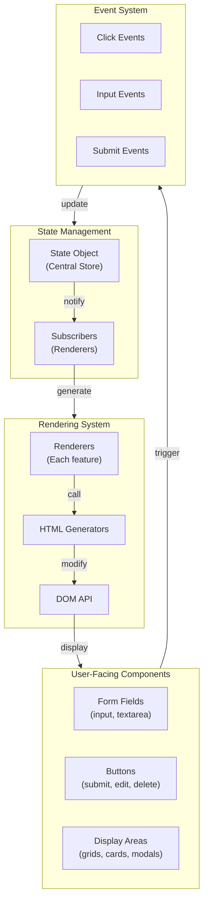

# Architecture Diagrams

## 1. Frontend Module Dependencies



## 2. Data Flow Architecture



## 3. Module Responsibilities



## 4. Backend API Routes



## 5. State Management Flow

```mermaid
graph LR
    A["User Action<br/>click button"] -->|triggers| B["Event Handler<br/>async function"]
    B -->|calls| C["API Module<br/>API.getX()"]
    C -->|HTTP request| D["Backend<br/>FastAPI"]
    D -->|JSON response| E["State Update<br/>State.set/update"]
    E -->|notify| F["Subscribers<br/>Renderers"]
    F -->|read| G["State.data"]
    G -->|generate HTML| H["DOM Update"]
    H -->|display| I["User Sees<br/>New state"]
```



## 6. Daily Words Feature Flow



## 7. Frontend File Organization

```
frontend/
│
├── index.html                    # 📄 Markup
│   └── Script loading order crucial
│
├── styles.css                    # 🎨 All CSS
│   ├── Dark neon theme
│   └── Responsive grid
│
├── app.js                        # 🎯 Orchestrator
│   ├── initEventListeners()
│   ├── refreshData()
│   ├── switchTab()
│   └── ~20 async handlers
│
└── modules/                      # 📦 Modular Core
    │
    ├── state.js                  # 💾 State
    │   ├── .data (read-only)
    │   ├── .get/set/update()
    │   ├── .subscribe()
    │   └── ~80 lines
    │
    ├── api.js                    # 🌐 HTTP
    │   ├── getTasks()
    │   ├── submitTraining()
    │   ├── getReport()
    │   └── ~60 lines
    │
    ├── utils.js                  # 🛠️ Helpers
    │   ├── DOM: el, elOrNull
    │   ├── Format: escapeHtml, renderMarkdown
    │   ├── UI: showToast, setStatus
    │   └── ~150 lines
    │
    └── renderers/                # 🎨 Features
        │
        ├── tasks.js              # 📋 Tasks & Practice
        │   ├── validateTaskForm()
        │   ├── render()
        │   └── ~120 lines
        │
        ├── flashcards.js         # 🎴 Flashcards
        │   ├── render()
        │   ├── refreshFilters()
        │   └── ~70 lines
        │
        ├── report.js             # 📊 Analytics
        │   ├── render()
        │   ├── renderPlotly()
        │   ├── openDaySessionsModal()
        │   └── ~250 lines
        │
        └── daily-words.js        # 📚 Daily Words
            ├── renderDailyWords()
            ├── renderDictionary()
            ├── submitDailyWords()
            └── ~280 lines
```

## 8. Backend Architecture



## 9. Database Schema Graph

```mermaid
graph LR
    U["USERS<br/>---<br/>id PK<br/>email"]
    
    T["TASKS<br/>---<br/>id PK<br/>user_id FK<br/>title<br/>description"]
    
    TS["TRAINING<br/>SESSIONS<br/>---<br/>id PK<br/>user_id FK<br/>task_id FK<br/>content<br/>feedback"]
    
    FC["FLASHCARDS<br/>---<br/>id PK<br/>user_id FK<br/>task_id FK<br/>front/back"]
    
    DWS["DAILY WORD<br/>SETS<br/>---<br/>id PK<br/>user_id FK<br/>date<br/>submitted"]
    
    DWE["DAILY WORD<br/>ENTRIES<br/>---<br/>id PK<br/>set_id FK<br/>word<br/>meaning<br/>user_sentence<br/>feedback"]
    
    UC["USER<br/>CONFIG<br/>---<br/>id PK<br/>user_id FK<br/>provider<br/>api_key"]
    
    U --> T
    U --> TS
    U --> FC
    U --> DWS
    U --> UC
    T --> TS
    T --> FC
    DWS --> DWE
```



## 10. Component Interaction Map



---

**Visualizações criadas para facilitar compreensão da arquitetura! 📊**
