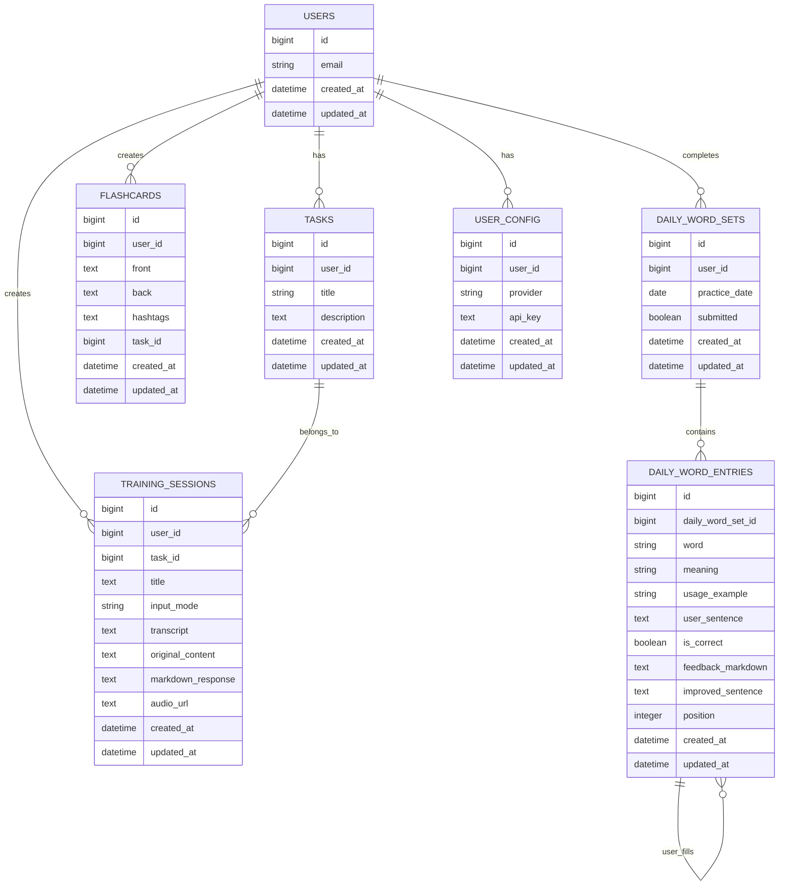

# Database Entity Relationship Diagram (ERD)

## Visual DER (Mermaid)



## Descrição Detalhada das Tabelas

### USERS
| Column | Type | Description |
|--------|------|-------------|
| id | BIGINT PK | Identificador único |
| email | VARCHAR | Email do usuário (único) |
| created_at | TIMESTAMP | Data de criação |
| updated_at | TIMESTAMP | Última atualização |

### USER_CONFIG
Armazena configurações do usuário (provider de IA, chave API)

| Column | Type | Description |
|--------|------|-------------|
| id | BIGINT PK | Identificador único |
| user_id | BIGINT FK → USERS | Usuário proprietário |
| provider | VARCHAR | 'openai' ou 'claude' |
| api_key | TEXT | Chave de API (encrypted em produção) |
| created_at | TIMESTAMP | Data de criação |
| updated_at | TIMESTAMP | Última atualização |

### TASKS
Tarefas/tópicos de aprendizado criados pelo usuário

| Column | Type | Description |
|--------|------|-------------|
| id | BIGINT PK | Identificador único |
| user_id | BIGINT FK → USERS | Usuário proprietário |
| title | VARCHAR | Título da tarefa |
| description | TEXT | Descrição completa |
| created_at | TIMESTAMP | Data de criação |
| updated_at | TIMESTAMP | Última atualização |

### TRAINING_SESSIONS
Sessões individuais de prática (texto ou áudio)

| Column | Type | Description |
|--------|------|-------------|
| id | BIGINT PK | Identificador único |
| user_id | BIGINT FK → USERS | Usuário |
| task_id | BIGINT FK → TASKS | Tarefa associada |
| title | VARCHAR | Título da sessão |
| input_mode | VARCHAR | 'text' ou 'audio' |
| transcript | TEXT | Transcrição (áudio) ou conteúdo original |
| original_content | TEXT | Alternativa para conteúdo |
| markdown_response | TEXT | Feedback IA em Markdown |
| audio_url | VARCHAR | URL do áudio processado (se aplicável) |
| created_at | TIMESTAMP | Data de criação |
| updated_at | TIMESTAMP | Última atualização |

### FLASHCARDS
Cards para memorização com feedback

| Column | Type | Description |
|--------|------|-------------|
| id | BIGINT PK | Identificador único |
| user_id | BIGINT FK → USERS | Usuário proprietário |
| task_id | BIGINT FK → TASKS | Tarefa associada |
| front | TEXT | Lado frontal do card |
| back | TEXT | Lado traseiro (resposta) |
| hashtags | TEXT | Tags separadas por vírgula |
| created_at | TIMESTAMP | Data de criação |
| updated_at | TIMESTAMP | Última atualização |

### DAILY_WORD_SETS
Conjunto diário de 10 palavras para treinar (um por dia)

| Column | Type | Description |
|--------|------|-------------|
| id | BIGINT PK | Identificador único |
| user_id | BIGINT FK → USERS | Usuário |
| practice_date | DATE | Data do treino (PK composta com user_id) |
| submitted | BOOLEAN | Se foi submetido/avaliado |
| created_at | TIMESTAMP | Data de criação |
| updated_at | TIMESTAMP | Última atualização |

### DAILY_WORD_ENTRIES
Palavras individuais dentro de um DAILY_WORD_SET

| Column | Type | Description |
|--------|------|-------------|
| id | BIGINT PK | Identificador único |
| daily_word_set_id | BIGINT FK → DAILY_WORD_SETS | Conjunto pai |
| word | VARCHAR | Palavra em inglês |
| meaning | TEXT | Significado em inglês |
| usage_example | TEXT | Exemplo de uso |
| user_sentence | TEXT | Frase do usuário |
| is_correct | BOOLEAN | null=pending, true=correto, false=errado |
| feedback_markdown | TEXT | Feedback da IA em Markdown |
| improved_sentence | TEXT | Versão corrigida da frase |
| position | INTEGER | Posição (1-10) no conjunto |
| created_at | TIMESTAMP | Data de criação |
| updated_at | TIMESTAMP | Última atualização |

## Relações Principais

### 1:N
- USERS → TASKS
- USERS → TRAINING_SESSIONS
- USERS → FLASHCARDS
- USERS → DAILY_WORD_SETS
- TASKS → TRAINING_SESSIONS
- TASKS → FLASHCARDS
- DAILY_WORD_SETS → DAILY_WORD_ENTRIES

### 1:1
- USERS → USER_CONFIG

## Índices Recomendados

```sql
-- Performance
CREATE INDEX idx_training_sessions_user_created ON training_sessions(user_id, created_at);
CREATE INDEX idx_training_sessions_task_id ON training_sessions(task_id);
CREATE INDEX idx_daily_word_sets_user_date ON daily_word_sets(user_id, practice_date);
CREATE INDEX idx_flashcards_user_task ON flashcards(user_id, task_id);

-- Unicidade
CREATE UNIQUE INDEX idx_daily_word_sets_unique ON daily_word_sets(user_id, practice_date);
CREATE UNIQUE INDEX idx_user_config_unique ON user_config(user_id);
```

## Consultas Frequentes

### Obter relatório do mês
```sql
SELECT 
  DATE(ts.created_at) as day,
  COUNT(DISTINCT ts.id) as session_count,
  COUNT(DISTINCT ts.task_id) as unique_tasks
FROM training_sessions ts
WHERE ts.user_id = $1
  AND DATE_TRUNC('month', ts.created_at) = DATE_TRUNC('month', $2::timestamp)
GROUP BY DATE(ts.created_at);
```

### Obter todas as palavras do dicionário do usuário
```sql
SELECT DISTINCT
  dwe.word,
  dwe.meaning,
  dwe.usage_example,
  dws.practice_date,
  dwe.user_sentence,
  dwe.is_correct
FROM daily_word_entries dwe
JOIN daily_word_sets dws ON dwe.daily_word_set_id = dws.id
WHERE dws.user_id = $1
ORDER BY dwe.word ASC;
```

### Analytics: Hashtags mais usadas
```sql
SELECT 
  UNNEST(STRING_TO_ARRAY(fc.hashtags, ',')) as hashtag,
  COUNT(*) as count
FROM flashcards fc
WHERE fc.user_id = $1
GROUP BY 1
ORDER BY 2 DESC;
```

## Notas de Design

1. **Sem Autenticação em Production**: Adicionar `password_hash` em USERS
2. **Soft Deletes**: Considerar adicionar `deleted_at` para audit trail
3. **Particionamento**: Se >1M registros, particionar TRAINING_SESSIONS por data
4. **Historização**: Considerar audit table para versioning
5. **Chaves API**: Criptografar em REST antes de salvar
